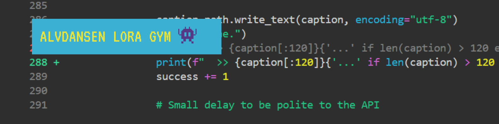

<p align="center">
  
</p>

# Alvdansen LoRA Gym

Open-source, production-ready training pipeline for character identity, motion, aesthetic, and style LoRAs on open-source video generation models. Built on [musubi-tuner (kohya-ss)](https://github.com/kohya-ss/musubi-tuner).

Currently supports the **Wan 2.1** and **Wan 2.2** model family with 24 training templates across every variant (T2V, I2V, 2.1, 2.2, Lightning-merged, and vanilla), triple-platform deployment (Modal, RunPod, and local GPU), and a complete dataset captioning toolkit.

> **[Notion Knowledge Base](https://www.notion.so/wan-2-2-2-1-musubi-gym-3096930d2e11812b9537dde1fa7942aa)** — Full training methodology, MoE architecture deep-dive, empirical findings, recommended settings, and active research notes.

## What's In the Box

**Captioning Tools** — Two Python scripts that auto-caption your images and videos for LoRA training. Point them at a folder, set your anchor word, and they generate `.txt` caption files that musubi-tuner reads automatically. Gemini (free) or Replicate (fast).

**24 Training Templates** — Copy-and-run training scripts for every Wan model variant on Modal (serverless), RunPod (bare metal), and local GPU (Windows/Linux). Each template handles VAE latent caching, T5 text encoder caching, and LoRA training with validated hyperparameters. For Wan 2.2, templates manage the dual-expert MoE architecture — high-noise and low-noise experts trained separately with correct timestep boundaries, precision settings, and flow shift values.

**Infrastructure Scripts** — One-command RunPod pod setup (`setup_runpod.sh`) and a Python-based local GPU setup script (`setup_local.py`) for training on your own machine (Windows/Linux). The local setup clones musubi-tuner, installs dependencies, downloads model weights, and can reuse compatible models from an existing ComfyUI installation.

**Guides** — Step-by-step training guides for both platforms, plus captioning methodology documentation.

## Quick Start

### Caption Your Dataset

```bash
pip install google-generativeai Pillow   # Gemini (free)
# or
pip install requests                      # Replicate (paid, faster)

python captioning/caption_gemini.py
# or
python captioning/caption_replicate.py
```

Configure your dataset path and anchor word in the script's `CONFIG` section. See [`captioning/docs/`](captioning/docs/) for the full captioning methodology — including per-LoRA-type strategies for characters, styles, motion, and objects.

### Train on Modal (Serverless)

```bash
pip install modal
python -m modal setup
python -m modal secret create my-huggingface-secret HF_TOKEN=hf_your_token

# Upload dataset
python -m modal run templates/modal/train_wan22_t2v_lightning.py::add_to_volume_datasets

# Train both experts (can run in parallel)
python -m modal run templates/modal/train_wan22_t2v_lightning.py::run_high
python -m modal run templates/modal/train_wan22_t2v_lightning.py::run_low
```

Full walkthrough: [`guides/WAN_LORA_MODAL_GUIDE.md`](guides/WAN_LORA_MODAL_GUIDE.md)

### Train on RunPod (Bare Metal)

Deploy an A100-80GB pod, upload your files, then:

```bash
bash /workspace/setup_runpod.sh
tmux new -s train
python /workspace/train_runpod_t2v_lightning.py --noise_level high
```

Full walkthrough: [`guides/RUNPOD_TRAINING_GUIDE.md`](guides/RUNPOD_TRAINING_GUIDE.md)

### Train Locally (Your Own GPU)

Runs on your own GPU. Recommended: 48GB VRAM (A6000, RTX 6000 Ada). Also works on 24GB cards (RTX 3090/4090) with `--blocks_to_swap` for video training. Needs 48GB+ system RAM and ~80GB free disk.

```bash
# 1. Set up (downloads ~40GB of models)
python setup/setup_local.py

# 2. Edit dataset config — update paths to your character's images/videos
#    templates/configs/wan22-dataset-config-local.toml

# 3. Train both experts
python templates/local/train_local_t2v_lightning.py --noise_level high
python templates/local/train_local_t2v_lightning.py --noise_level low
```

Already have ComfyUI? Save download time by reusing compatible models:
```bash
python setup/setup_local.py --comfyui_dir C:/path/to/ComfyUI
```

Full walkthrough: [`guides/LOCAL_TRAINING_GUIDE.md`](guides/LOCAL_TRAINING_GUIDE.md)

### Train with Claude Code (AI-Assisted)

Tell Claude Code what you want in plain English and it reads, writes, and executes everything for you — validating dozens of interdependent parameters where a single mismatch silently ruins a run.

```
> Read WAN_LORA_CLAUDE_CODE_REFERENCE.md.
> Train a Wan 2.2 T2V character LoRA for strawberryman on Modal.
> My dataset is in datasets/strawberryman/. Use validated production config.
```

See [`docs/claude-code-training.md`](docs/claude-code-training.md) for setup and usage.

## Repository Structure

```
lora-gym/
├── captioning/              # Dataset captioning tools
│   ├── caption_gemini.py    #   Free-tier Gemini captioner
│   ├── caption_replicate.py #   Paid Replicate captioner (faster)
│   └── docs/                #   Captioning methodology & guides
├── templates/               # Training script templates
│   ├── modal/               #   8 Modal templates (serverless)
│   ├── runpod/              #   8 RunPod templates (bare metal)
│   ├── local/               #   Local GPU templates (Windows/Linux)
│   └── configs/             #   Dataset config TOMLs
├── guides/                  # Platform training guides
├── setup/                   # Infrastructure scripts
│   ├── setup_runpod.sh      #   One-command RunPod pod setup
│   └── setup_local.py       #   Local setup (Python, cross-platform)
└── docs/                    # Graduated reference documentation
```

## Training Templates

### Wan 2.2 (MoE Dual-Expert)

| Model / Task | Modal | RunPod | Local |
|---|---|---|---|
| T2V Lightning (4-step) | `train_wan22_t2v_lightning.py` | `train_runpod_t2v_lightning.py` | `train_local_t2v_lightning.py` |
| T2V Vanilla (30-50 step) | `train_wan22_t2v_vanilla.py` | `train_runpod_t2v_vanilla.py` | `train_local_t2v_vanilla.py` |
| I2V Lightning (4-step) | `train_wan22_i2v_lightning.py` | `train_runpod_i2v_lightning.py` | `train_local_i2v_lightning.py` |
| I2V Vanilla (30-50 step) | `train_wan22_i2v_vanilla.py` | `train_runpod_i2v_vanilla.py` | `train_local_i2v_vanilla.py` |

### Wan 2.1 (Single Model)

| Model / Task | Modal | RunPod | Local |
|---|---|---|---|
| T2V 14B (production) | `train_wan21_t2v_14b.py` | `train_runpod_wan21_t2v_14b.py` | `train_local_wan21_t2v_14b.py` |
| T2V 1.3B (prototyping) | `train_wan21_t2v_1_3b.py` | `train_runpod_wan21_t2v_1_3b.py` | `train_local_wan21_t2v_1_3b.py` |
| I2V 14B 720p | `train_wan21_i2v_720p.py` | `train_runpod_wan21_i2v_720p.py` | `train_local_wan21_i2v_720p.py` |
| I2V 14B 480p | `train_wan21_i2v_480p.py` | `train_runpod_wan21_i2v_480p.py` | `train_local_wan21_i2v_480p.py` |

## How It Works

The pipeline has three layers:

**Dataset tools** (your PC) prepare and caption training data.
**Training templates** (cloud GPU or local GPU) run a 3-step process: cache VAE latents, cache T5 text encoder outputs, train LoRA adapters on the DiT diffusion model.
**Inference** (ComfyUI) loads trained LoRAs for video generation.

For Wan 2.2, the DiT uses a **Mixture-of-Experts architecture** with two separate experts gated by a hard timestep switch. You train two LoRAs per concept (high-noise for composition/motion, low-noise for texture/identity) and load both at inference. The templates handle all the flags, precision settings, and flow shift values correctly so you don't have to debug them yourself.

## Methodology

Quality over speed. Lower learning rates (2e-5 to 8e-5) consistently outperform community defaults (1e-4+). We invest in careful captioning before optimizing anything else. We validate on 1.3B before committing to 14B.

Our templates document several original findings including bug fixes for undocumented issues in musubi-tuner and validated hyperparameter defaults derived from cross-referencing multiple practitioners' results in the space, rather than untested community defaults.

For the full training methodology, MoE architecture deep-dive, empirical findings, and active research — see our **[Notion knowledge base](https://www.notion.so/wan-2-2-2-1-musubi-gym-3096930d2e11812b9537dde1fa7942aa)**.

## What's Coming

- **Recommended Settings** — Specific recommended settings templates paired with sample datasets for reproducible benchmarking
- **Claude Code Training Assistant** — Pre-programmed agent that walks you through the entire training process from your terminal
- **Control LoRA via Late-Stage Injection** — R&D effort to add depth controllability to character LoRAs through curriculum training (co-authored by Minta and Timothy)
- **Community Distribution** — Trained example LoRAs on HuggingFace, ComfyUI workflow files, methodology writeup

## Contributors

**[Minta](https://github.com/alvdansen)** — Pipeline lead. Extended the pipeline to RunPod and Thunder Compute, developed the Wan 2.2 MoE dual-expert training strategy, built the Lightning LoRA merge integration. Leads experimental validation and script development across all platforms. Co-author of the Control LoRA research brief.

**[Timothy](https://github.com/timm156)** — Developed the original Wan 2.1 LoRA training pipeline on Modal using musubi-tuner. Co-develops training methodology, hyperparameter strategy, and infrastructure decisions. Co-author of the Control LoRA via Late-Stage Injection research brief.

## Acknowledgments

This project builds on [musubi-tuner](https://github.com/kohya-ss/musubi-tuner) by kohya-ss and [AI Toolkit](https://github.com/ostris/ai-toolkit) by Ostris. We're grateful to the ML researchers and engineers who helped us develop our understanding of model training, and to the practitioners sharing their findings in GitHub discussions, CivitAI guides, and Discord channels — Sarania, GhostInShell, Taz, ComfyTinker, and many others. The community knowledge you've built is the foundation everything here stands on.

## License

Apache 2.0 — see [LICENSE](LICENSE) for details.
